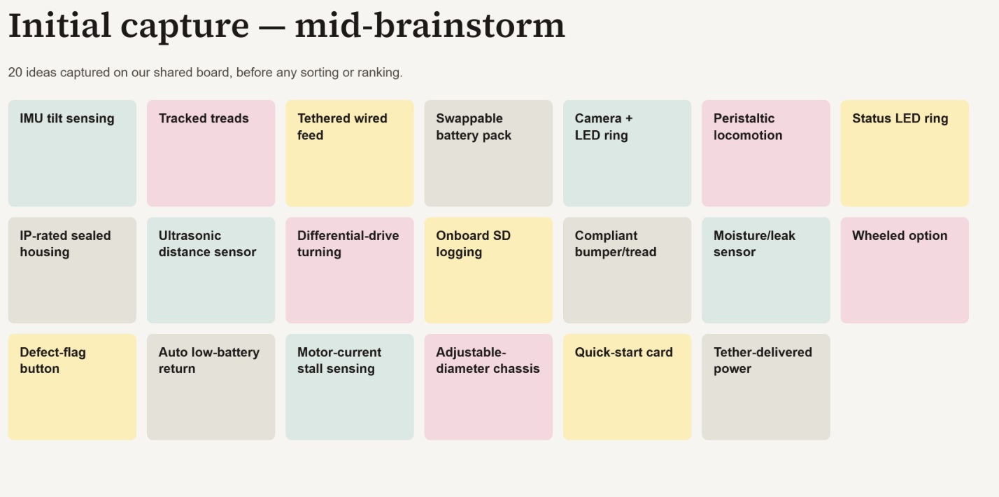
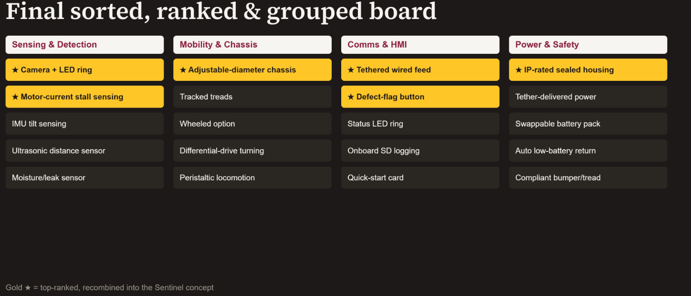
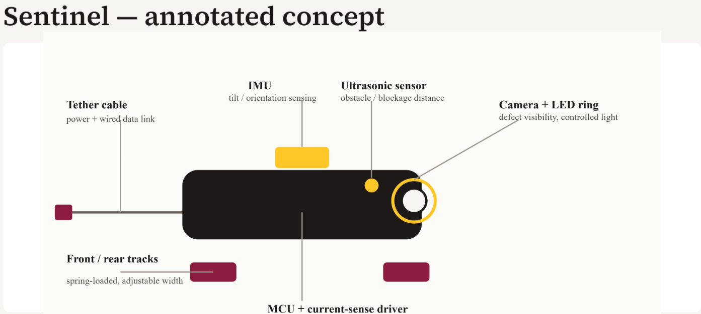

## About our Project
The main goal of this project is to apply the embedded systems design process to develop a working prototype for inspecting installed conduit. Throughout the project, our team will design, build, program, and test the electrical and mechanical components needed for the system. We also hope to build a device that is reliable in its duties.

Our primary audience is construction and maintenance companies that work in stalling or inspection of underground conduits. During a class meeting, our team learned more about the problem from a representative from Sundt Constructions to discusses their needs in this device. This device would help these companies inspect conduits without having to pay a third party to bring in specialized tools for inspection

## Idea Generation (Unsorted)

## Idea Generation (Sorted)

## Concept Sketch

## Presentation

