# Component Selection

This page documents the components selected for the conduit inspection device and the reasoning behind each selection.

## Microcontroller

| Component | Image | Advantages | Disadvantages | Link |
|-----------|-------|------------|---------------|------|
|      ESP32-S3-WROOM-1-N4     |    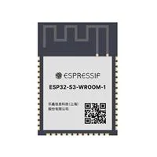   |    *Has Antenna attached. *plenty of GPIO * 3.3V is low power requirement.        |      Must place carefully to not interfere with antenna.         |   [Link](https://www.digikey.com/en/products/detail/espressif-systems/ESP32-S3-WROOM-1-N4/16162639) Price : $5.21  |
|     PIC18F27Q10-I/SO      |    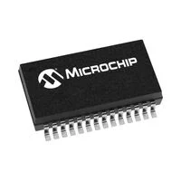   |      Familiarity from being used in previous class, Large community library, Low Cost.     |     Requires an antenna attachment for WI-FI communication .        |   [Link](https://www.digikey.com/en/products/detail/microchip-technology/PIC18F27Q10-I-SO/10064343) Price: $1.31  |
|     ESP32-S3-WROOM-1U-N4     |    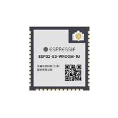   |      Same specification as ESP32-S3-WROOM-1-N4      |      No Antenna attachment for WI-FI communication.         |   [Link](https://www.digikey.com/en/products/detail/espressif-systems/ESP32-S3-WROOM-1U-N4/16162640) Price: $5.21|

Selection : ESP32-S3-WROOM-1-N4
Reason: For our project our team decided that the low power requirement of 3.3V is ideal for sensors chosen. The added antenna is also a big advantage as we will not have to create our own antenna and filtering circuit as it is already attached to the esp. This microcontroller can handle multiple i2c or spi connections as well as having a large online community. 

## Power Regulator

| Component | Image | Advantages | Disadvantages | Link |
|-----------|-------|------------|---------------|------|
|       LM2575D2T-3.3R4G    |   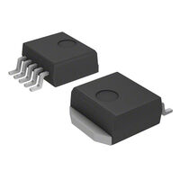    |    Can take from 5v to 40V input, Regulated 3.3V output, High efficiency of buck regulator, familiar with through hole version.        |      Lower frequency of 52-Khz is outdated.         |   [Link](https://www.digikey.com/en/products/detail/onsemi/LM2575D2T-3-3R4G/1476688)  Price: $2.23 |
|   LM2595S-3.3        |   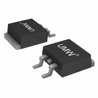    |     Can take from 5v to 40V input,  High efficiency of buck regulator 15-Khz       |    Lower inventory will need to keep an eye on.           |  [Link](https://www.digikey.com/en/products/detail/umw/LM2595S-3-3/24889929) Price: $1.44   |
|    MIC4721YMM-TR       |   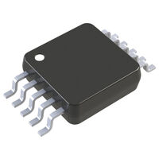    |    Low price, High frequency 3.3-Mhz,1.5ma current will take care of our sensors.        |        will have to calculate need inductor and capacitor for our required voltage, only 5.5V input.       |   [Link](https://www.digikey.com/en/products/detail/microchip-technology/MIC4721YMM-TR/1640308) Price: $0.88   |

Selection: LM2575D2T-3.3R4G
Reason: this Buck regulator can take a wide input voltage range from 5V to 40V and steps it down to a regulated 3.3V. This is ideal the wide input range allows up to have two power rails while only needing one regulator. We can have a higher voltage coming in to power our motor and then regulate that down to power our microcontroller and other sensors. The 3.3V output is enough to power the esp32. Being a buck regulator gives us an efficiency of around 75%.

## Motor Driver 

| Component | Image | Advantages | Disadvantages | Link |
|-----------|-------|------------|---------------|------|
|  L9110S         |   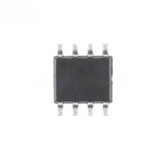     |     Cheap       |      Low  Voltage Rating         |  [Link](https://www.digikey.com/en/products/detail/umw/L9110S/17635270) Price: $0.61   |
|     TB67H450FNG,EL     |   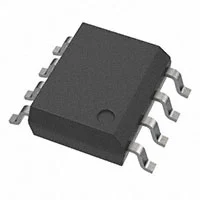     |     High Voltage Rating       |        Expensive       |  [Link](https://www.digikey.com/en/products/detail/toshiba-semiconductor-and-storage/TB67H450FNG-EL/10130904) Price: $1.33    |
|      DRV8220DRLR     |    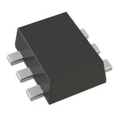    |      Cheap, High  Voltage Rating      |        Requires Thermal Consideration       |  [Link](https://www.digikey.com/en/products/detail/texas-instruments/DRV8220DRLR/15295783)  Price: $0.90    |

Selection: TB67H450FNG,EL
Reason: Able to use 12V without requiring extra thermal considerations.

## Motor 

| Component | Image | Advantages | Disadvantages | Link |
|-----------|-------|------------|---------------|------|
|       711    |     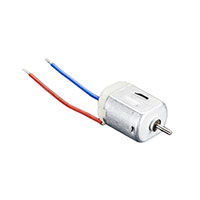  |     Fast, Cheap       |      Low power  Output         |  [Link](https://www.digikey.com/en/products/detail/adafruit-industries-llc/711/5353610)  Price: $1.95    |
|      PKN7EB105C7   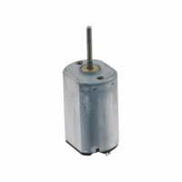  |       |      Small      |     Expensive, Low Power output          |  [Link](https://www.digikey.com/en/products/detail/nmb-technologies-corporation/PKN7EB105C7/2417076?s=N4IgTCBcDaIAQAUDSA5A7AUQEIEYAMArAMJogC6AvkA)  Price: $4.43   |
|    11696       |    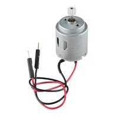   |     High Power Output       |      Large         |  [Link](https://www.digikey.com/en/products/detail/sparkfun-electronics/11696/6163657) Price: $2.75   |

Selection:11696
Reason: High output is ideal for locomotion.

## Distance Sensor 

| Component | Image | Advantages | Disadvantages | Link |
|-----------|-------|------------|---------------|------|
|           |       |            |               |      |
|           |       |            |               |      |
|           |       |            |               |      |

## Camera and Lighting (Subsystem 4)

### Camera

| Component | Image | Advantages | Disadvantages | Link |
|---|---|---|---|---|
| **OV2640 2MP camera, 24-pin FPC (selected)** |  | Best-supported camera in Espressif's esp32-camera library; outputs JPEG directly, which saves ESP32 memory; very cheap; wide-angle lens options | Only 2MP; needs separate 2.8V and 1.2V supplies; fragile ribbon cable | [Example listing](INSERT-LINK) |
| OV5640 5MP camera, 24-pin FPC |  | Higher resolution and autofocus versions available; also supported by esp32-camera | Costs more; higher current; larger frames strain the ESP32's memory | [Example listing](INSERT-LINK) |
| OV7670 0.3MP camera |  | Very cheap; common in tutorials | Very low resolution; no JPEG output; uses a pin header instead of a ribbon, so it's bulky | [Example listing](INSERT-LINK) |

**Choice:** OV2640. It has the best ESP32 support, outputs compressed JPEG to save memory, and gives enough resolution to spot cracks and joints in a 6-inch pipe.

### Camera voltage regulators (2.8V and 1.2V)

| Component | Image | Advantages | Disadvantages | Link |
|---|---|---|---|---|
| **XC6206 series LDO, SOT-23 (selected)** |  | Same part in 2.8V and 1.2V versions; tiny; very low quiescent current; used in common ESP32-CAM designs | Only 200 mA max output; max input of 6V | [2.8V](https://www.digikey.com/en/products/detail/umw/XC6206P282MR/17635224), [1.2V](https://www.digikey.com/en/products/detail/torex-semiconductor-ltd/XC6206P122MR-G/10161703) |
| AP2112K series LDO, SOT-23-5 |  | 600 mA output; has an enable pin | Needs an extra pin and part for enable; more than the camera needs | [DigiKey search](https://www.digikey.com/en/products/result?keywords=AP2112K-1.2) |
| Buck converter module |  | Very efficient | Switching noise can show up in the video; more parts; larger | — |

**Choice:** XC6206. The camera only draws about 100 mA, so a small, simple, quiet linear regulator is the best fit, and using the same part family for both voltages keeps the design simple.

### LED lighting

| Component | Image | Advantages | Disadvantages | Link |
|---|---|---|---|---|
| **ams OSRAM DURIS E 2835 white LED (selected)** |  | Rated 150 mA, so it runs cool at our ~60 mA; wide 120° beam lights the whole pipe; small SMD package | Brightness changes slightly as the battery drains | [DigiKey](https://www.digikey.com/en/products/detail/ams-osram-usa-inc/GW-JTLPS1-CM-JNKN-XX51-1-150-R33/13680870) |
| Cree J Series 2835 white LED |  | Reputable brand; similar performance | Costs a bit more | [DigiKey](https://www.digikey.com/en/products/detail/cree-led/JB2835BWT-G-U22GA0000-N0000001/14554783) |
| XINGLIGHT 2835 white LED |  | Very cheap | Rated only 60 mA, so it would run at its limit in our circuit | [DigiKey](https://www.digikey.com/en/products/detail/xinglight/XL-2835UWC-02/25673184) |

**Choice:** DURIS E 2835. Three in series from the 12V supply with one 51 Ω resistor gives even lighting at well under the LED's rating.
